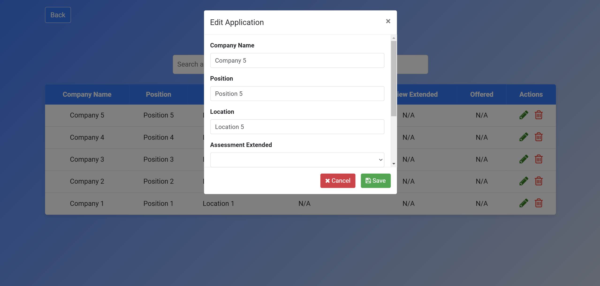

## EnterSmart: Job Application Data Entry Tool
This CRUD web application simplifies the process of tracking job applications by providing a user-friendly interface for entering, editing, deleting, and viewing job application data.

### Features
- **Interactive Web Form**: Input company names, job positions, and locations.
- **Application History View**: Displays a list of all submitted job applications.
- **Search Functionality**: Quickly locate specific applications in the history view.
- **Edit Functionality**: Modify existing application entries through an easy-to-use modal interface.
- **Delete Functionality**: Remove application entries with confirmation using a deletion modal.
- **Dynamic Updates**: UI updates dynamically without requiring a page reload.

### Built With
- **Frontend**: HTML, CSS, JavaScript, Bootstrap.
- **Backend**: Python with Flask.
- **Data Handling**: 
  - **Pandas**
  - **Excel** (openpyxl engine).

### Prerequisites
Ensure you have Python installed along with Flask and Pandas. You can install the required packages using pip:
```bash
pip install Flask pandas openpyxl
```

### Running the Application
1. Clone the repository:
   ```bash
   git clone https://github.com/nifemi-l/EnterSmart.git
   ```
2. Navigate to the project directory:
   ```bash
   cd <project_directory>
   ```
3. Run the application:
   ```bash
   python app.py
   ```
4. Open your web browser and navigate to `http://localhost:5000` to use the application.

### Files
- `index.html`: Entry page where users can input new job applications.
- `application-history.html`: Page for viewing, editing, and deleting application history.
- `app.py`: Flask backend handling data submission, retrieval, updates, and deletions.
- `data.xlsx`: File storing job application data (created automatically if not present).

### New Features Overview
- **Editing Applications**:
  - Accessible via a pencil icon in the history table.
  - Opens a modal pre-filled with the application details for modification.
  - Saves changes dynamically to the Excel file and updates the UI instantly.
- **Deleting Applications**:
  - Triggered by the trash icon in the history table.
  - Prompts a confirmation modal before deletion.
  - Removes entries from both the UI and Excel file.

### Images



